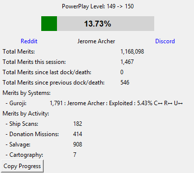

# EDMC-PowerPlayProgress

## Summary

PowerPlayProgress is a EDMC addon that assists Elite Dangerous cmdrs in tracking their power play progress between docking/death events as well as per system.

 

## Requirements
* [EDMC] version 5.7 and above (python 3.11)

## Installation

* Download the [latestrelease] of EDMC-PowerPlayProgress
  * Appropriate versions of both are available on every release page
* Extract the `.zip` archives that you downloaded into the EDMC `plugins` folder
  * This is accessible via the plugins tab in the EDMC settings window
* Start or restart EDMC to register the plugin

## License

[PowerPlayProgress] Copyright © 2025 [alby666]

Licensed under the [GNU Public License (GPL)][GPLv2] version 2 or later.

[EDMC]: https://github.com/EDCD/EDMarketConnector/wiki
[PowerPlayProgress]: https://github.com/alby666/EDMC-PowerPlayProgress
[latestrelease]: https://github.com/alby666/EDMC-PowerPlayProgress/releases/latest
[GPLv2]: http://www.gnu.org/licenses/gpl-2.0.html
[alby666]: https://github.com/alby666

