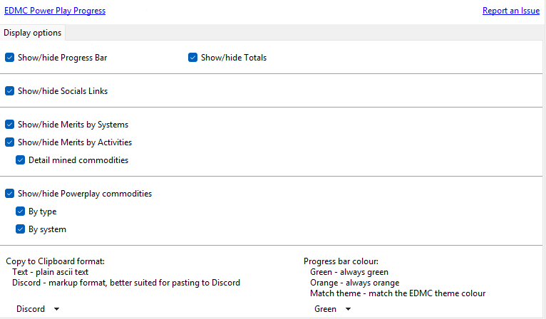
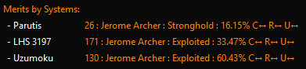
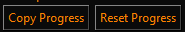

# EDMC-PowerPlayProgress

## TBA: there is a bug in Elite Dangerous with Donation Missions, currently the merits are being doubled in the logs https://issues.frontierstore.net/issue-detail/75777

## Summary

EDMC-PowerPlayProgress is a EDMC addon that assists Elite Dangerous cmdrs to track their power play progress:

 

* Visual progress between ranks, cleared progress bar and customisible colours
* Links to Reddit and Discord sites for your Power
* Total merits between dock/death events 
* Merits gained per system - clickable systems with links to Inara, EDSM & Spansh
* Tracks power play commodities collections & deliveries by the ton 
  * Count per Power commodity type
  * Count per Power data
  * Count delivered by system
* Ability to reset the progress counters
* NEW FEATURE: Locate the nearest rare commodities to your current system

     

* NEW FEATURE: High & Low Trade Route Suggestions - Identify profitable trade routes for PowerPlay activities
  * **Reinforcement Mode**: Find commodities with 40%+ profit margins to sell in your power's controlled systems
  * **Undermining Mode**: Find cheap commodities (<500cr/ton) to flood rival power markets
  * Real-time data from Ardent API with stock levels, station information, and pad size requirements
  * Smart window positioning that stacks below the rares window when both are open
  * Click the "Trade Routes" button to open the window for your current system

* Merits by Activity - rival power kills tracking & better ship scanning

    

  * Ship/Wake scans
  * Bounties (even less now assigned to unknowns!!)
  * Power play commodities deliveries
  * Donation and aid missions (duplicate journal entries bug still an issue but EDMC-PPP now tracks the donation merits correctly with the error entries being allocated to unknowns)
  * Scan Data Links
  * Holoscreen Hacks
  * Rare Goods
  * Salvage
  * Cartograhy - large multi-sell activities now tracked
  * High Value Commodities
  * Low Value Commodities
  * Exobiology
  * Mined Commodities
  * On Foot activities
  * Commit Crimes
  * Rival Power Kills
  * Unknowns (the journals have limited infomation so some will slip through the net when assigning them!)

  Will continue to improve the tracking and correct assignment to the correct systems but the current journal info is a limiting factor... :(

* Preferences to show/hide all recorded info
  * Customisble progress bar colour, green, orange or match the EDMC theme
  * NEW: Custom format for copy to clipboard, use any of the following placeholders to format the output
    * default: [{system}]({system_url}) - {merits} - {state} e.g. [Alrai Sector HM-V b2-6](https://inara.cz/elite/starsystem/?search=13864288789953) - 20 - Exploited

  

### Merits by systems
  

  * Right click on systems for options
  
    

  * Left click on systems to visit your preferred website (adjust via EDMC settings) 

  

1. The system name
2. The merits you have earned in this system
3. The controlling power
4. The current power state
5. The power play state control progress
6. The trend since EDMC was launched
  - ↑ - increasing, ↓ - decreasing, ← - the same
  * C = State Control Progress trend
  * R = Reinforcement Score trend
  * U = Undermining Score trend

### Functions

* Copy Progress - copies the current displayed progress to the clipboard, configure it in preferences for markup/Discord friendly or text output

  

* Reset - resets the current progress counters (except for the overall session total)
* Reset Session - resets the Total Merits this session (helpful for clearing duplicate errors)
* Rares - display the nearest 10 rare commidities to your current system

## Requirements
* [EDMC] version 5.12 and above (python 3.11)

## Installation

* Download the [latestrelease] of EDMC-PowerPlayProgress
* Extract the `.zip` archives that you downloaded into the EDMC `plugins` folder
  * This is accessible via the plugins tab in the EDMC settings window
* Start or restart EDMC to register the plugin

## License

[PowerPlayProgress] Copyright © 2025 [alby666]

Licensed under [MIT].

[EDMC]: https://github.com/EDCD/EDMarketConnector/wiki
[PowerPlayProgress]: https://github.com/alby666/EDMC-PowerPlayProgress
[latestrelease]: https://github.com/alby666/EDMC-PowerPlayProgress/releases/latest
[MIT]: https://github.com/alby666/EDMC-PowerPlayProgress/blob/main/LICENSE
[alby666]: https://github.com/alby666

