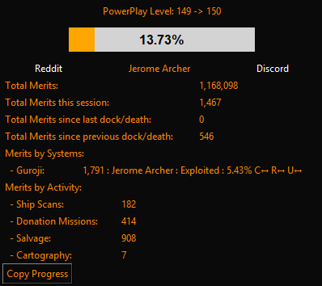

# EDMC-PowerPlayProgress

## Summary

EDMC-PowerPlayProgress is a EDMC addon that assists Elite Dangerous cmdrs to track their power play progress:

 

* Visual progress between ranks
* NEW: Links to Reddit and Discord sites for your Power
* Total merits between dock/death events 
* Merits gained per system
* Tracks power play commodities collections & deliveries by the ton
  * Count per power play commodity type
  * Count by delivered system
* Merits by Activity (work in progress)

    

  * Ship scans
  * Bounties
  * Power play deliveries
  * Donation and aid missions
  * NEW: Scan Data Links
  * NEW: Holoscreen Hacks
  * NEW: Rare Goods
  * NEW: Salvage
  * NEW: Cartograhy
  * NEW: High Value Commodities
  * NEW: Low Value Commodities
  * NEW: Exobiology
  * NEW: Mined Commodities
  * NEW: on Foot activities
  * Unknowns (the journals have limited infomation so some will slip through the net when assigning them!)

  Will continue to improve the tracking and correct assignment to the correct systems but the current journal info is a limiting factor... :(

* NEW: Preferences to show/hide all recorded info

  

### Merits by systems

  

1. The system name
2. The merits you have earned in this system
3. The controlling power
4. The current power state
5. The power play state control progress
6. The trend since EDMC was launched
  - ↑ - increasing, ↓ - decreasing, ← - the same
  * C = State Control Progress trend
  * R = Reinforcement Score trend
  * U = Undermining Score trend

## Requirements
* [EDMC] version 5.12 and above (python 3.11)

## Installation

* Download the [latestrelease] of EDMC-PowerPlayProgress
* Extract the `.zip` archives that you downloaded into the EDMC `plugins` folder
  * This is accessible via the plugins tab in the EDMC settings window
* Start or restart EDMC to register the plugin

## License

[PowerPlayProgress] Copyright © 2025 [alby666]

Licensed under the [GNU Public License (GPL)][GPLv2] version 2 or later.

[EDMC]: https://github.com/EDCD/EDMarketConnector/wiki
[PowerPlayProgress]: https://github.com/alby666/EDMC-PowerPlayProgress
[latestrelease]: https://github.com/alby666/EDMC-PowerPlayProgress/releases/latest
[GPLv2]: http://www.gnu.org/licenses/gpl-2.0.html
[alby666]: https://github.com/alby666

